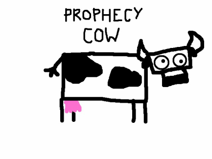

## Prophecy Cow

My friend Lily runs the Prophecy Cow website [http://www.prophecycow.com/p/prophecy-home.html]. She secretly does the prediction herself. When the Prophecy Cow starts to get famous, the workload becomes human-incapable. Here we summon the power of machine learning for rescue. 

---

## Corpus

* The corpus used in the prediction is downloaded from (http://www.ngrams.info/samples_coca1.asp). 
* Only the 2g and 3g case insensitive corpora are used in this app. 
* Only the top 5 predictions of each word (or first two words in the 3g case) are kept in the corpora to reduce its size (since we will be giving only 5 suggestions anyways).

---

## Algorithm

The prophecy cow is a cow afterall. She predicts things in the simplest way possible. She suggests whatever word follows the word you entered the most frequently. She understands the complexity of human world so she gives five suggestions (the 5 most frquently 2-gram phrase). If you're still not satisfied, you can check the box for "No, none of those are what I meant next", and enter your own.

---

## Future work

The prophecy cow is in the process of learning to spit out a whole sentence.

